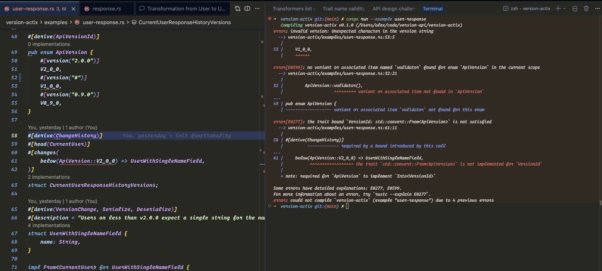

+++
date = '2026-03-08T13:45:20+03:00'
draft = false
title = 'Api Versioning: Part 1 - Response versioning'
+++

## Introduction

> "APIs are Forever" — Werner Vogels

API consumers expect stability — once they've integrated your API, breaking changes are off the table. At the same time, your product naturally needs to evolve, and new features can require changes that would break existing consumers.

There are other ways to maintain backward compatibility — for example, versioning via the request path (`/v1/users` → `/v2/users`). However, maintaining multiple endpoints for each version can introduce significant maintenance overhead for your team.

I was inspired by [Stripe's approach to API versioning](https://stripe.com/blog/api-versioning), but their post didn't go into detail on how the versioning module actually worked under the hood.

That's what led me to build [version-api](https://github.com/Tevinthuku/version-api) (terrible name, I know) — an attempt to figure out how such a versioning module can actually work.

## How it works

Your endpoint always returns the **latest** response shape. When a consumer sends a request pinned to an older API version, the library automatically downgrades the response through a chain of transformers until it matches what that version expects.

Let's walk through a concrete example using [Actix Web](https://actix.rs/) — it's the Rust web framework I'm most familiar with. The library hasn't been published to crates.io yet, so if you'd like to follow along, you can [clone the repo](https://github.com/Tevinthuku/version-api) & have a look at the [actix web example.](https://github.com/Tevinthuku/version-api/blob/main/version-actix/examples/user-response.rs)

### 1. Define your API versions

First, declare the versions your API supports. The newest version comes first:

```rust
use version_core::{
    ApiVersionId, ChangeHistory, VersionChange, registry::ApiResponseResourceRegistry,
};

#[derive(ApiVersionId)]
enum ApiVersion {
    #[version("2.0.0")]
    V2_0_0,
    #[version("1.0.0")]
    V1_0_0,
}
```

##### Internals

Under the hood, the `ApiVersionId` derive macro validates each `#[version("...")]` literal at compile time — if a string isn't a valid version, your code won't compile. It also enforces that versions are listed in descending order, keeping the list consistent and predictable.



The macro implementation lives [here](https://github.com/Tevinthuku/version-api/blob/main/version-api-macros/src/derive_api_version_id.rs).

### 2. Write your endpoint against the latest shape

Your handler always returns the current / latest DTO

```rust
use version_actix::{VersionedJsonResponder};

#[derive(Serialize, Deserialize)]
struct CurrentUser {
    first_name: String,
    last_name: String,
}

#[get("/users/{id}")]
async fn get_user(id: web::Path<String>) -> Result<VersionedJsonResponder<CurrentUser>> {
    let user = CurrentUser {
        first_name: "Jane".into(),
        last_name: "Doe".into(),
    };
    Ok(VersionedJsonResponder(user))
}
```

##### Internals

`VersionedJsonResponder` implements Actix-web's Responder trait, so it plugs directly into any handler return type. It wraps your response model and handles API versioning automatically at response time.
Your handler always returns the latest model. When the response goes out, `VersionedJsonResponder` checks the client's API version using a `VersionIdExtractor` (more on this later), looks up any registered downgrade transforms, applies them if needed, and serializes the result to JSON.
If the client is on the latest version (or if no versionId is provided, eg: if version header is missing), nothing happens -- the model is returned as-is.
It keeps version logic out of your handlers entirely.

### 3. Describe the change history

As shown above, In v2.0.0 we split the name field into first_name and last_name. Consumers on older versions still expect the single name field, so we describe that with a ChangeHistory:

```rust
use version_core::{
    ApiVersionId, ChangeHistory,
};

#[derive(ChangeHistory)]
#[head(CurrentUser)]
#[changes(
    below(ApiVersion::V2_0_0) => UserWithSingleNameField,
)]
struct CurrentUserResponseHistory;
```

This reads as: "The head (latest) shape is CurrentUser. For any version below 2.0.0, downgrade it to UserWithSingleNameField."

### 4. Implement the downgrade

Define the older shape and a From conversion that maps the current structure back to it:

```rust
use version_core::{
    VersionChange,
};
#[derive(VersionChange, Serialize, Deserialize)]
#[description = "Consumers below v2.0.0 expect a single name field"]
struct UserWithSingleNameField {
    name: String,
}

impl From<CurrentUser> for UserWithSingleNameField {
    fn from(user: CurrentUser) -> Self {
        Self {
            name: format!("{} {}", user.first_name, user.last_name),
        }
    }
}
```

##### Internals

#[derive(ChangeHistory)] constructs a sequential transformation chain from newer response shapes to older ones. The chain starts at the #[head] type (the latest version of your response) and walks through each entry in #[changes], in order:

```bash
Head → Change₁ → Change₂ → … → Changeₙ
```

Each arrow represents a single downgrade step. For every adjacent pair in the chain, the macro generates a hidden struct that implements VersionChangeTransformer. That struct's transform method simply calls From::from to convert the left type into the right type. This means you must provide a From implementation for every adjacent pair in the chain.

If any From implementation is missing, you will get a compile-time error — the macro emits a From<A> for B assertion for every adjacent pair, so the Rust compiler catches omissions before your code ever runs.

Example:

```rust
#[derive(ChangeHistory)]
#[head(User)]
#[changes(
    below(MyApiVersions::V2_0_0) => CollapseUserAddressesToStrings,
    below(MyApiVersions::V1_0_0) => CollapseUserAddressToSingleString,
)]
struct UserResponseHistoryVersions;
```

This produces the chain:

```bash
User → CollapseUserAddressesToStrings → CollapseUserAddressToSingleString
```

So you need exactly two From implementations — one per arrow:

Step From impl required When it runs

1 `From<User> for CollapseUserAddressesToStrings` Client requests a version below V2_0_0 (e.g. V1_0_0, V0_9_0)

2 `From<CollapseUserAddressesToStrings> for CollapseUserAddressToSingleString` Client requests a version below V1_0_0 (e.g. V0_9_0)

Notice that each From converts from the immediately preceding type in the chain, not from `Head`. The transformations are applied sequentially: to reach `CollapseUserAddressToSingleString`, the framework first downgrades `User` into `CollapseUserAddressesToStrings`, then downgrades that result into `CollapseUserAddressToSingleString`.

See the [full implementation](https://github.com/Tevinthuku/version-api/blob/main/version-api-macros/src/derive_change_history.rs).

### 5. Wire it up

Register the change history and tell the framework / actix in this case how to extract the version from incoming requests (here, from an X-API-Version header):

```rust
let mut registry = ApiResponseResourceRegistry::new();
CurrentUserResponseHistory::register(&mut registry).unwrap();

let version_extractor = BaseActixVersionIdExtractor::header_extractor(
    "X-API-Version".to_string(),
    // `validator()` is auto-generated by `#[derive(ApiVersionId)]`.
    // It returns a `VersionIdValidator` that parses a raw version
    // string (e.g. "2.0.0") and rejects values that don't match
    // a variant defined in your ApiVersionId enum.
    ApiVersion::validator(),
);

let registry = web::Data::new(registry);
let version_id_extractor = web::Data::new(version_id_extractor);
HttpServer::new(move || {
        App::new()
            .service(get_user)
            .app_data(registry.clone())
            .app_data(version_id_extractor.clone())
    })
    .bind(("127.0.0.1", 8080))?
    .run()
.await
```

Now when a consumer sends X-API-Version: 1.0.0, they get

```json
{ "name": "Jane Doe" }
```

A consumer on 2.0.0 (or with no header) gets

```json
{ "first_name": "Jane", "last_name": "Doe" }
```

Your handler code stays the same either way.

#### Internals

#### A different take on organizing version changes

Stripe groups all changes across all resources into a single master list keyed by version date. A single version entry can contain Changes [for all sorts of objects](https://stripe.com/blog/api-versioning).

This library takes the opposite approach: changes are organized per resource. Each `ChangeHistory` declaration captures the complete transformation chain for a single response type — from its current shape all the way back to its oldest supported form. A developer looking at UserResponseHistoryVersions immediately sees every shape User has ever taken and in what order, without sifting through unrelated changes to other types.

This should make debugging more straightforward. When a response comes back with unexpected data, you look at the single `ChangeHistory` for that resource, walk the chain, and pinpoint exactly which `From` conversion produced the wrong output — rather than scanning a global changelog for the entries that happen to touch your type. The ApiResponseResourceRegistry does hold all change histories for all resources at runtime, but that's a runtime dispatch detail — at the code level, each resource's transformation logic lives in one place.

The only globally shared definition is the ApiVersion enum (annotated with #[derive(ApiVersionId)]), which acts as the single source of truth for which versions your application supports. Everything else — the change types, the From conversions, the ChangeHistory declaration — is scoped to the resource it belongs to.

#### How ApiResponseResourceRegistry works

ApiResponseResourceRegistry is the runtime lookup table at the heart of the versioning system. It maps (head type, version) pairs to transformers — the downgrade steps generated by ChangeHistory.

#### Registration

When you call `YourChangeHistory::register(&mut registry)`, the macro-generated code registers each transformer keyed by two things:

The `TypeId` of the head type (e.g. User) — so the registry knows which transformers apply to which response type.
The VersionId from the below(...) annotation — so the registry knows at which version boundary each transformer kicks in.
This means a single registry can hold change histories for many different response types side by side, each isolated by their head type's `TypeId`.

##### Version extraction in actix

There are two key abstractions that work together to resolve which API version a client is requesting:

`ActixVersionIdExtractor` — a trait responsible for pulling a version identifier out of an incoming HttpRequest. How the version is determined is entirely up to the implementation. The trait returns Option<VersionId>: Some if the client specified a version, None if they didn't (in which case the response is returned as-is, untransformed).

`VersionIdValidator` — a trait responsible for parsing and validating a raw version string (e.g. "2.0.0") into a VersionId. It rejects anything that doesn't correspond to a version your application has defined. When you derive ApiVersionId on your versions enum, a validator is auto-generated and available via YourEnum::validator().

##### The built-in extractor

`BaseActixVersionIdExtractor` is the provided implementation of ActixVersionIdExtractor. It covers the straightforward case: the client sends the desired version in an HTTP header on every request (e.g. X-API-Version: 1.0.0). It reads the header, passes the raw value through the VersionIdValidator, and returns the result.

##### Custom extractors

Consumers can implement their own ActixVersionIdExtractor for more complex scenarios. For example, Stripe pins an API version to the user's account rather than sending it per-request. To support this pattern, you might write a middleware that resolves the account's pinned version and attaches it to the request extensions, then write a custom extractor that reads from those extensions instead of a header.

##### VersionedJsonResponder ties it all together

`VersionedJsonResponder` is the glue. When building a response, it pulls whatever `ActixVersionIdExtractor` has been registered in actix's app_data, calls extract on the request, and — if a version was returned — hands the value off to the ApiResponseResourceRegistry to walk the downgrade chain. It has no knowledge of which extractor is being used or how the version was determined. You swap the strategy simply by registering a different extractor in app_data, keeping the entire system extensible without touching the responder.

### A note on the initial API design

I'll be honest — I really struggled with this part. I had no reference points for how a versioning API should look, so I leaned on Claude Opus 4.6 to help explore the design space. The model suggested the following:

```rust
#[derive(VersionedSnapshot)]
struct UserWithNameOnly { name: String }

#[derive(VersionedSnapshot)]
struct UserWithSingleAddress { name: String, address: String }

#[derive(VersionedResponse)]
#[response(versions(
    "v1" => UserWithSingleAddress,
    "v2" => UserWithNameOnly,
))]
struct User { name: String, addresses: Vec<String> }
```

I pushed back on this design for one key reason:

The mapping "v2" => UserWithNameOnly is ambiguous — does it mean consumers on `v2` receive `UserWithNameOnly`, or consumers below `v2`? I wanted the latter, but the syntax reads like the former. An API's ergonomics matter, and if the person reading the macro has to pause and wonder which interpretation is correct, the design isn't clear enough.
When I raised this concern, the model doubled down and insisted this was the best approach. I dropped the conversation, stepped away from the repo for a few days, and when I came back with fresh eyes, the `below(ApiVersion::V2_0_0) => UserWithSingleNameField` syntax clicked for me — it removes the ambiguity entirely.

Stay in the driver's seat

This experience reinforced something I think is important when building with LLMs: you have to stay in the driver's seat. Models can now be remarkably persuasive — and when they stick to their guns, it's tempting to just go along with it. But the developer is the one who has to live with the design, maintain the code, and answer to the users. If something feels off, trust that instinct. Push back, explore alternatives, and don't let the model's confidence substitute for your own judgment.

### Next steps

1. **Request transformation (Part 2):** This post focused on response downgrading — transforming the latest response shape into what older clients expect. Part 2 will tackle the other direction: request upgrading. When a client on an older API version sends a request body (or query parameters), the framework will transform it forward through the version chain so your handler always receives the latest shape. Same idea, reverse direction.

2. **Error handling overhaul:** The current error handling leans on Box<dyn std::error::Error> and std::io::Error as catch-all wrappers, which isn't great for debuggability or for consumers matching on specific failure cases. I plan to introduce a dedicated error type that makes it clear whether a failure came from version validation, transformation, serialization, or registration.

3. **Opt-in tracing** — when a response passes through a chain of transformers, things can go wrong in ways that are hard to diagnose. Adding optional tracing support would let developers inspect the full transformation pipeline: which version was requested, which transformers ran, and what the intermediate shapes looked like. Spans would default to `debug` level to keep production logs clean, unless explicitly configured otherwise.

4. **Publish to crates.io** — someday, maybe. No promises.

Thanks for reading!
